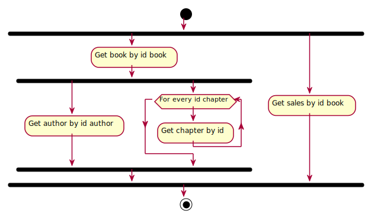

# Taller sobre ¿_Monad transformer_ o es otra cosa mejor? #

Este es un _**taller**_ donde vamos a empezar con un acercamiento a las 
monadas desde **Java** intentando solucionar un hipotético problema que 
tenemos: intentar combinar dos efectos el Futuro y el Either, cuando 
simulamos llamadas a servicios reactivos implementado a partir de 
actores de Akka  y que devuleven `Future<Either>`. Parece que la 
solución va a ser implementar una clase de utilidades que nos ayude a 
gestionar todo esto.

Por otra parte imaginemos que un cliente para lo que tiene no necesita
esa complejidad y quiere un servicio "_como los de toda la vida_". Para 
ello tenemos los mismos servicios con la misma funcionalidad y que 
retornan nuestro propio contenedor que no es "nada sospechoso" de ser 
una monada.

Primero nos daremos cuenta que la lógica de negocio cambiará si 
elegimos uno u otro tipo de servicios y entonces es cuando nos 
preguntamos ¿Por qué tengo que cambiar mi lógica de negocio si cambio el
tipo que devuelve el resultado?


## Primer enfoque ##

Vemos que con nuestra propia implementación de la MonadError podemos 
solucionar el problema tanto de la nuestra "_Monad transformer_" como
de nuestro contenedor y empezamos a tener la sensación de estar
utilizando un **DSL**. Pero (siempre hay un pero) Nos obliga a tener 
código repetido y nos gustaría tener nuestra lógica de una manera
más clara y declarativa


## La solución ##

Llega **Scala** al rescate con la '_magia_' de sus '_constructores de 
tipos_' y sus '_implícitos_' y su poder de generar DSLs de manera 
elegante. Veremos que se puede tener la lógica definida de manera 
declarativa de una manera elegante independiente de si se trabaja de 
manera síncrona o asíncrona, y con perfecta integración con código 
**Java**.

# El ejercicio #

## Requisitos ##

Para que funcione tienes que tener instalado **maven**, y si lo 
prefieres, para tu mayor comodidad, que tu IDE tenga soporte a 
**Scala**.

## Esquema de composición de la información ##



## El reto ##

Intenta que pasen todos los test, ejecutando.

```
mvn clean test
```

Recuerda que deberás tener en cuenta el control de errores.

# Apendice: fork en git

 ## Fork github
 - Registrate con tu usuario en **github** 
 - Ve a [https://github.com/logicaalternativa/monad-transformer-and-more](https://github.com/logicaalternativa/monad-transformer-and-more)
 - Haz un Fork del repositorio
 
 ## Clonar el repo en tu máquina
 - Copia la URL de tu repositorio  
 - Clona tu repositorio ejecutando en tu máquina
    
            git clone <la-url-de-tu-repo>
            cd monad-transformer-and-more
  
  - Añade el repositorio del workshop como remoto
  
            git remote add upstream https://github.com/logicaalternativa/monad-transformer-and-more.git
  
## Mantener tu rama y repo actualizadas
  
      git checkout <rama_taller>
      git pull upstream <rama_taller>
      git push origin <rama_taller>
  
## Recomendaciones
  
  - Para evitar merges y conflictos crea una rama de trabajo a partir de
    la rama del curso.
    
            git checkout <rama_taller>
            git checkout -b <mi_rama_trabajo>
    
  
    

